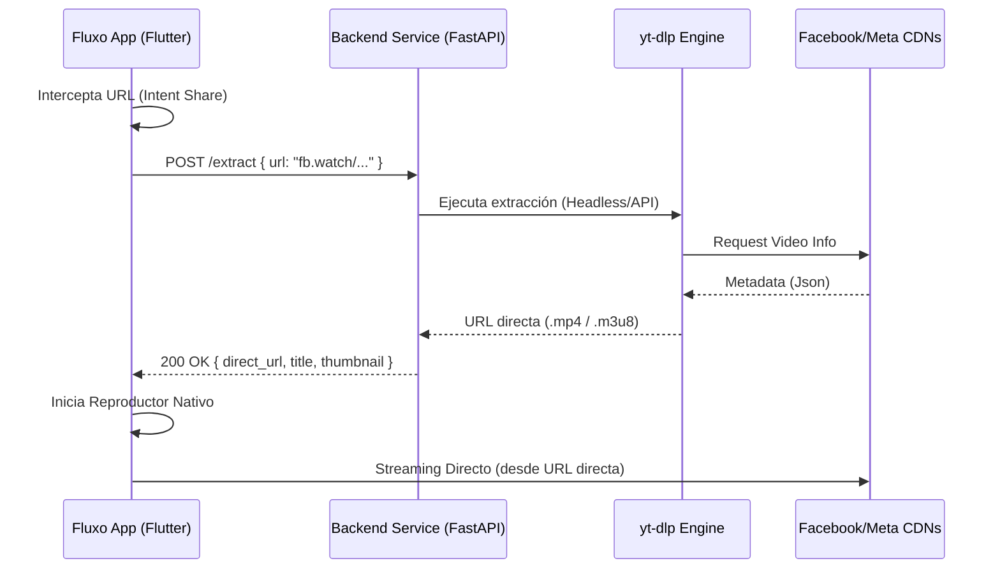

# Arquitectura de Extracción de Video - Fluxo Service

## 1. Visión General
Para mitigar las limitaciones de ejecutar scrapers complejos en dispositivos móviles (actualizaciones frecuentes, bloqueo de IPs, consumo de batería), se implementará una arquitectura cliente-servidor.

### Decisión Técnica Final
**Stack Backend**: Python (FastAPI) + `yt-dlp`.
**Justificación**: `yt-dlp` es la herramienta estándar de industria, escrita en Python. Integrarla nativamente en un backend Python reduce la latencia y complejidad de mantenimiento comparado con wrappers en Node.js. FastAPI ofrece alto rendimiento asíncrono para manejar múltiples requests concurrentes.

## 2. Flujo de Datos

## 3. Componentes del Sistema

### A. Fluxo App (Cliente)
- **Responsabilidad**: Capturar Intent, Validar URL, UI de "Cargando", Reproducción.
- **Seguridad**: No almacena tokens a largo plazo.

### B. Extractor Service (Backend)
- **Responsabilidad**: Interfaz HTTP, Gestión de procesos `yt-dlp`, Caché temporal de URLs (Redis opcional para evitar re-scraping inmediato).
- **Endpoint Principal**: `POST /api/v1/resolve`

## 4. Riesgos y Mitigaciones

| Riesgo | Impacto | Estrategia de Mitigación |
| :--- | :--- | :--- |
| **Bloqueo de IP (Rate Limiting)** | Alto (Servicio inoperable) | 1. Rotación de Proxies Residenciales. 2. Cookies Netscape exportadas de cuenta "dummy". |
| **Cambios en API de Facebook** | Medio (Fallo de extracción) | 1. Actualización automática diaria de `yt-dlp` en el servidor. 2. Monitoreo de logs de error. |
| **Expiración de URLs (Token Decay)** | Bajo (Video no reproduce después de X tiempo) | La App no debe guardar URLs extraídas. Siempre solicitar fresca al usuario o re-extraer si falla. |
| **Videos Privados/Geo-bloqueo** | Medio | Reportar error claro al usuario ("Contenido privado o no disponible"). |

## 5. Estrategia de Producción
- **Contenerización**: Docker (Imagen base ligera python:slim).
- **Deploy**: Cloud Run o VPS (DigitalOcean/AWS) para facilitar escalado y gestión de IPs estáticas/proxies.
